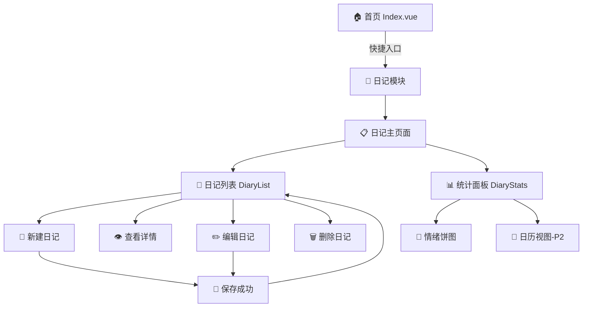
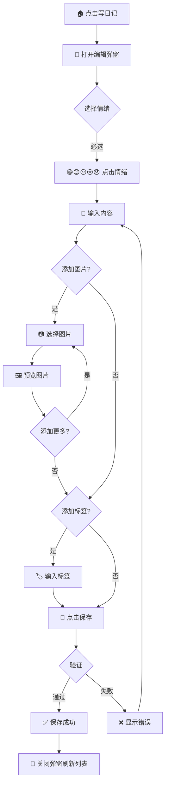
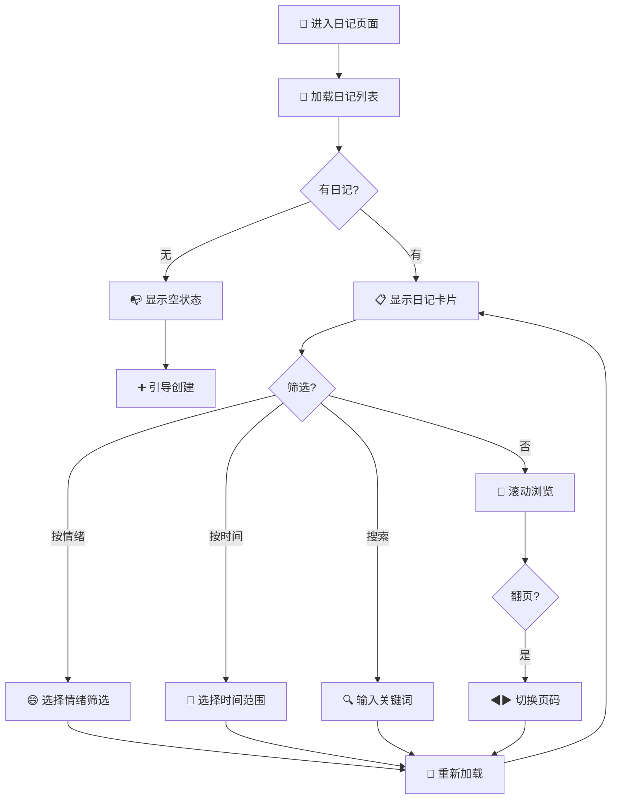
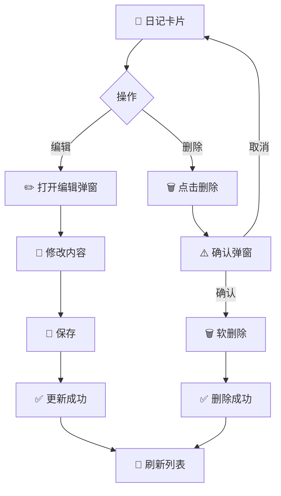
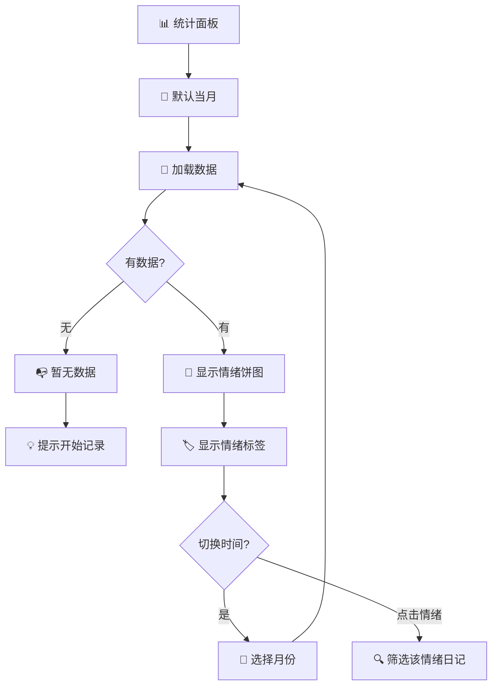

# 日记模块 UI/UX 规格文档

> 📅 创建日期: 2024-12-17  
> 🎨 设计师: Sally (UX Expert)  
> 📊 版本: v1.0  
> 📄 关联架构: [docs/architecture-diary.md](./architecture-diary.md)  
> 📄 关联简报: [docs/brief-diary.md](./brief-diary.md)

---

## 目录

1. [引言](#1-引言)
2. [信息架构](#2-信息架构)
3. [用户流程](#3-用户流程)
4. [线框图与布局](#4-线框图与布局)
5. [组件库](#5-组件库)
6. [品牌与样式指南](#6-品牌与样式指南)
7. [无障碍要求](#7-无障碍要求)
8. [响应式策略](#8-响应式策略)
9. [动效与微交互](#9-动效与微交互)
10. [性能考虑](#10-性能考虑)
11. [下一步行动](#11-下一步行动)

---

## 1. 引言

本文档定义了 **日记模块（Diary Module）** 的用户体验目标、信息架构、用户流程和视觉设计规范。它是视觉设计和前端开发的基础，确保提供连贯且以用户为中心的体验。

### 1.1 目标用户画像

| 画像 | 描述 | 核心需求 |
|------|------|---------|
| **麦麦（主用户）** | 工作繁忙的都市年轻人，想要记录生活但常忘记 | 快速记录、低门槛、情绪追踪 |
| **情绪敏感型用户** | 希望通过日记了解自己情绪波动规律的用户 | 情绪可视化、数据洞察 |
| **回忆收集者** | 喜欢记录生活点滴，偶尔翻看过去日记的用户 | 图文结合、时间轴浏览 |

### 1.2 可用性目标

| 目标 | 描述 | 量化标准 |
|------|------|---------|
| **易学性** | 用户无需引导即可完成首次记录 | <30秒完成首篇日记 |
| **效率** | 日常记录流程极简 | 3步完成（选情绪→写内容→保存） |
| **情感满足** | 记录过程带来愉悦感 | emoji情绪、视觉反馈 |
| **回顾价值** | 月度情绪统计提供价值洞察 | 饼图一眼看懂 |

### 1.3 设计原则

1. **情绪先行 (Emotion First)** — 情绪选择置于首位，强化仪式感
2. **一屏完成 (Single Screen Focus)** — 核心操作不滚动，所见即所得
3. **温暖而私密 (Warm & Private)** — 色调温暖，强调个人空间感
4. **渐进呈现 (Progressive Disclosure)** — 高级功能（图片、标签）折叠
5. **即时反馈 (Instant Feedback)** — 每次操作都有视觉/微动效响应

### 1.4 变更日志

| 日期 | 版本 | 描述 | 作者 |
|------|------|------|------|
| 2024-12-17 | v1.0 | 初始版本 | Sally |

---

## 2. 信息架构

### 2.1 站点地图



### 2.2 导航结构

#### 主导航（Primary Navigation）

| 位置 | 入口 | 目标 |
|------|------|------|
| **侧边栏 Navbar** | 新增"日记"菜单项 | `/index-diary` |
| **首页快捷区** | "写日记"按钮 | `/index-diary`（自动打开新建弹窗） |

#### 页内导航（Secondary Navigation）

```
日记主页面布局
┌─────────────────────────────────────────────────┐
│  📔 我的日记                     🔍 筛选  ➕ 新建 │ ← 顶部操作栏
├─────────────────────────────────────────────────┤
│                                                 │
│  ┌──────────────────┐  ┌──────────────────────┐│
│  │                  │  │                      ││
│  │   📜 日记列表    │  │   📊 统计面板       ││
│  │                  │  │   (侧边/可折叠)     ││
│  │  [卡片]          │  │                      ││
│  │  [卡片]          │  │   🥧 情绪分布       ││
│  │  [卡片]          │  │                      ││
│  │  ...             │  │   📈 连续记录       ││
│  │                  │  │                      ││
│  └──────────────────┘  └──────────────────────┘│
│                                                 │
│  ◀ 1 2 3 4 5 ▶                                 │ ← 底部分页
└─────────────────────────────────────────────────┘
```

#### 面包屑策略

```
首页 → 日记
```

> 💡 日记模块只有一级深度，面包屑简化为单层。

---

## 3. 用户流程

### 3.1 创建日记流程（核心流程）

**用户目标：** 快速记录今天的心情和想法

**入口点：** 
- 首页"写日记"按钮
- 日记列表页"新建"按钮

**成功标准：** 日记保存成功，列表刷新显示新日记



**边缘情况与错误处理：**

| 场景 | 处理方式 |
|------|---------|
| 未选择情绪直接保存 | 情绪选择器高亮提示，阻止保存 |
| 内容为空 | 允许（纯情绪记录）但给出温馨提示 |
| 图片过大（>5MB） | 提示"图片太大啦，压缩一下吧" |
| 图片格式不支持 | 提示支持的格式（jpg/png/gif） |
| 网络错误 | 显示重试按钮，内容不丢失 |

### 3.2 浏览日记列表流程

**用户目标：** 查看历史日记，回顾过去的心情



### 3.3 编辑/删除日记流程

**用户目标：** 修改已有日记或删除不需要的记录



### 3.4 查看情绪统计流程

**用户目标：** 了解自己这段时间的情绪分布



---

## 4. 线框图与布局

### 4.1 设计工具

| 属性 | 值 |
|------|---|
| **设计工具** | ASCII Wireframes（本文档内） |
| **实现参考** | Element Plus 组件库 |
| **视觉风格** | 参考现有系统（finance/photo_wall模块） |

### 4.2 日记主页面（Index.vue）

```
┌─────────────────────────────────────────────────────────────────┐
│  [Navbar]                                              [User] 👤 │
├─────────────────────────────────────────────────────────────────┤
│                                                                  │
│  ┌───────────────────────────────────────────────────────────┐  │
│  │  📔 我的日记                                              │  │
│  │                                                           │  │
│  │  ┌─────────────────────┐   ┌────────────────────────┐    │  │
│  │  │  🔍 搜索日记...     │   │ 😄 │ 📅 本月 ▼ │ ➕ 新建│    │  │
│  │  └─────────────────────┘   └────────────────────────┘    │  │
│  └───────────────────────────────────────────────────────────┘  │
│                                                                  │
│  ┌─────────────────────────────────┐  ┌──────────────────────┐  │
│  │                                 │  │  📊 情绪统计         │  │
│  │  ┌─────────────────────────┐   │  │                      │  │
│  │  │ 😄 2024-12-17          │   │  │    ┌──────────┐      │  │
│  │  │ 今天很开心              │   │  │    │  🥧     │      │  │
│  │  │ 完成了日记模块的开发... │   │  │    │  饼图   │      │  │
│  │  │ 🏷️ 工作 编程           │   │  │    └──────────┘      │  │
│  │  │              [✏️] [🗑️] │   │  │                      │  │
│  │  └─────────────────────────┘   │  │  😄 开心  15 (48%)   │  │
│  │                                 │  │  😊 平静   8 (26%)   │  │
│  │  ┌─────────────────────────┐   │  │  😐 一般   5 (16%)   │  │
│  │  │ 😊 2024-12-16          │   │  │  😢 低落   2 (6%)    │  │
│  │  │ 平静的一天              │   │  │  😠 烦躁   1 (3%)    │  │
│  │  │ 今天天气很好，去公园... │   │  │                      │  │
│  │  │ 🖼️ [图片预览]          │   │  │  ───────────────     │  │
│  │  │              [✏️] [🗑️] │   │  │  🔥 连续记录: 7天    │  │
│  │  └─────────────────────────┘   │  │                      │  │
│  │                                 │  └──────────────────────┘  │
│  │         ◀  1  2  3  4  5  ▶    │                             │
│  └─────────────────────────────────┘                             │
│                                                                  │
└─────────────────────────────────────────────────────────────────┘
```

**布局说明：**

| 区域 | 组件 | 说明 |
|------|------|------|
| **顶部操作栏** | 搜索框 + 筛选按钮 + 新建按钮 | 快速操作入口 |
| **左侧主区域** | DiaryList 日记卡片列表 | 占据60%宽度 |
| **右侧面板** | DiaryStats 统计面板 | 占据40%宽度，可折叠 |
| **底部分页** | el-pagination | 标准分页组件 |

### 4.3 日记编辑弹窗（DiaryEdit.vue）

```
┌─────────────────────────────────────────────────────────┐
│  ✏️ 写日记                                         [✕]  │
├─────────────────────────────────────────────────────────┤
│                                                         │
│  今天心情如何？                                         │
│  ┌─────────────────────────────────────────────────┐   │
│  │  😄      😊      😐      😢      😠            │   │
│  │  开心    平静    一般    低落    烦躁           │   │
│  │  [●]     [ ]     [ ]     [ ]     [ ]           │   │
│  └─────────────────────────────────────────────────┘   │
│                                                         │
│  日期 📅                                               │
│  ┌─────────────────────────────────────────────────┐   │
│  │  2024-12-17                               [📅]  │   │
│  └─────────────────────────────────────────────────┘   │
│                                                         │
│  标题（可选）                                           │
│  ┌─────────────────────────────────────────────────┐   │
│  │  今天很开心                                     │   │
│  └─────────────────────────────────────────────────┘   │
│                                                         │
│  写点什么吧...                                          │
│  ┌─────────────────────────────────────────────────┐   │
│  │                                                 │   │
│  │  完成了日记模块的开发，感觉很有成就感！         │   │
│  │  明天继续加油 💪                                │   │
│  │                                                 │   │
│  └─────────────────────────────────────────────────┘   │
│                                                         │
│  ┌──────────────────────────────────────────────┐      │
│  │  📷 添加图片        🏷️ 添加标签              │      │
│  └──────────────────────────────────────────────┘      │
│                                                         │
│  ┌─────┐ ┌─────┐ ┌─────┐                               │
│  │ 🖼️ │ │ 🖼️ │ │  +  │  ← 图片预览区                 │
│  └─────┘ └─────┘ └─────┘                               │
│                                                         │
│  🏷️ [工作] [编程] [+添加]  ← 标签区                    │
│                                                         │
├─────────────────────────────────────────────────────────┤
│                          [取消]  [💾 保存日记]          │
└─────────────────────────────────────────────────────────┘
```

**交互说明：**

| 元素 | 交互行为 |
|------|---------|
| **情绪选择器** | 点击切换，带缩放动效 |
| **日期选择** | el-date-picker，默认今天 |
| **内容输入框** | 自动扩展高度，min-height: 120px |
| **添加图片** | 点击展开图片上传区 |
| **添加标签** | 点击展开标签输入 |
| **保存按钮** | 未选情绪时禁用，带loading状态 |

### 4.4 日记卡片（DiaryCard.vue）

```
┌────────────────────────────────────────────────────┐
│  😄 开心                            2024-12-17 周二 │
├────────────────────────────────────────────────────┤
│                                                    │
│  今天很开心                                        │ ← 标题（加粗）
│                                                    │
│  完成了日记模块的开发，感觉很有成就感！明天继     │ ← 内容预览
│  续加油...                                         │   (max 2行)
│                                                    │
│  ┌──────┐ ┌──────┐                                │
│  │ 🖼️  │ │ 🖼️  │  ← 图片缩略图（最多显示3张）   │
│  └──────┘ └──────┘                                │
│                                                    │
│  🏷️ 工作  编程                                    │ ← 标签
│                                                    │
├────────────────────────────────────────────────────┤
│                               [👁️ 查看] [✏️] [🗑️] │ ← 操作按钮
└────────────────────────────────────────────────────┘
```

**状态变化：**

| 状态 | 视觉表现 |
|------|---------|
| **默认** | 白底卡片，浅灰边框 |
| **悬停** | 轻微上浮阴影，边框变主题色 |
| **情绪色彩** | 左侧边框使用情绪对应颜色 |

---

## 5. 组件库

### 5.1 设计系统方案

| 属性 | 值 |
|------|---|
| **基础框架** | Element Plus（沿用现有系统） |
| **定制程度** | 轻度定制 - 仅针对日记模块特色组件 |
| **CSS策略** | Scoped CSS + CSS变量复用 |

### 5.2 定制组件

#### MoodSelector（情绪选择器）

```vue
<!-- src/components/diary/MoodSelector.vue -->
<template>
  <div class="mood-selector">
    <div class="mood-label">今天心情如何？</div>
    <div class="mood-options">
      <div 
        v-for="mood in moods" 
        :key="mood.value"
        class="mood-item"
        :class="{ active: modelValue === mood.value }"
        @click="$emit('update:modelValue', mood.value)"
      >
        <span class="mood-emoji">{{ mood.emoji }}</span>
        <span class="mood-text">{{ mood.label }}</span>
      </div>
    </div>
  </div>
</template>
```

| 属性 | 说明 |
|------|------|
| **用途** | 日记创建/编辑时选择情绪 |
| **变体** | 默认（横向5选1）、紧凑（无文字标签） |
| **状态** | 未选、已选、禁用 |

#### DiaryCard（日记卡片）

| 属性 | 说明 |
|------|------|
| **用途** | 日记列表中展示单条日记 |
| **变体** | 默认、紧凑（移动端） |
| **状态** | 默认、悬停、加载中 |

#### MoodChart（情绪图表）

| 属性 | 说明 |
|------|------|
| **用途** | 统计面板中展示情绪分布 |
| **变体** | 饼图、环形图 |
| **交互** | 点击扇区筛选对应情绪日记 |

### 5.3 复用 Element Plus 组件

| 组件 | 用途 | 配置 |
|------|------|------|
| **el-dialog** | 编辑/详情弹窗 | width="600px", center |
| **el-input** | 标题输入 | placeholder, clearable |
| **el-input type="textarea"** | 内容输入 | autosize, rows=4 |
| **el-date-picker** | 日期选择 | type="date", 默认今天 |
| **el-button** | 各种按钮 | type/size/icon |
| **el-tag** | 标签展示 | closable, effect="plain" |
| **el-upload** | 图片上传 | list-type="picture-card" |
| **el-pagination** | 列表分页 | layout, page-sizes |
| **el-empty** | 空状态 | description, image |
| **el-popconfirm** | 删除确认 | title, confirm-button-text |
| **el-message** | 操作反馈 | type, duration |

---

## 6. 品牌与样式指南

### 6.1 色彩系统

#### 主色板（沿用系统色）

| 颜色类型 | Hex 色值 | 用途 |
|---------|----------|------|
| **Primary** | `#409EFF` | 主按钮、链接、选中态 |
| **Success** | `#67C23A` | 成功状态、确认操作 |
| **Warning** | `#E6A23C` | 警告、注意提示 |
| **Danger** | `#F56C6C` | 错误、删除操作 |
| **Info** | `#909399` | 辅助信息、占位文字 |

#### 情绪色板（日记模块专属）

| 情绪 | Emoji | Hex 色值 | 色彩含义 |
|------|-------|----------|---------|
| **开心 happy** | 😄 | `#67C23A` | 生机绿 - 活力、积极 |
| **平静 good** | 😊 | `#409EFF` | 天空蓝 - 平和、稳定 |
| **一般 neutral** | 😐 | `#909399` | 中性灰 - 平淡、日常 |
| **低落 sad** | 😢 | `#E6A23C` | 暖橙色 - 温暖、治愈 |
| **烦躁 angry** | 😠 | `#F56C6C` | 珊瑚红 - 释放、宣泄 |

#### 图表配色

```javascript
// ECharts 情绪饼图配色
const MOOD_CHART_COLORS = [
  '#67C23A',  // happy - 绿色
  '#409EFF',  // good - 蓝色
  '#909399',  // neutral - 灰色
  '#E6A23C',  // sad - 橙色
  '#F56C6C'   // angry - 红色
];
```

### 6.2 字体排版

#### 字体家族

| 类型 | 字体栈 |
|------|--------|
| **Primary** | `"Helvetica Neue", Helvetica, "PingFang SC", "Microsoft YaHei", Arial, sans-serif` |
| **Monospace** | `"SFMono-Regular", Consolas, "Liberation Mono", Menlo, monospace` |

#### 字号规范

| 元素 | 字号 | 字重 | 行高 |
|------|------|------|------|
| **H1** | 24px | 600 | 1.4 |
| **H2** | 18px | 600 | 1.4 |
| **H3** | 16px | 600 | 1.4 |
| **Body** | 14px | 400 | 1.6 |
| **Small** | 12px | 400 | 1.5 |

#### 日记内容排版

```css
.diary-content {
  font-size: 15px;
  line-height: 1.8;
  color: #303133;
  letter-spacing: 0.5px;
}
```

### 6.3 图标系统

| 功能 | 图标 | 来源 |
|------|------|------|
| **新建日记** | `<Plus />` | @element-plus/icons-vue |
| **编辑** | `<Edit />` | @element-plus/icons-vue |
| **删除** | `<Delete />` | @element-plus/icons-vue |
| **查看** | `<View />` | @element-plus/icons-vue |
| **日期** | `<Calendar />` | @element-plus/icons-vue |
| **图片** | `<Picture />` | @element-plus/icons-vue |
| **标签** | `<PriceTag />` | @element-plus/icons-vue |
| **搜索** | `<Search />` | @element-plus/icons-vue |
| **情绪** | 😄😊😐😢😠 | Emoji（原生） |

### 6.4 间距规范

| 间距等级 | 像素值 | 用途 |
|---------|--------|------|
| **xs** | 4px | 紧凑元素间距 |
| **sm** | 8px | 图标与文字间距 |
| **md** | 16px | 组件内部间距 |
| **lg** | 24px | 区块间距 |
| **xl** | 32px | 页面边距 |

---

## 7. 无障碍要求

### 7.1 合规目标

| 属性 | 值 |
|------|---|
| **目标标准** | WCAG 2.1 Level A |
| **优先级** | MVP阶段实现基础无障碍 |

### 7.2 关键要求

#### 视觉无障碍

| 要求 | 规范 | 实现方式 |
|------|------|---------|
| **颜色对比度** | 文字:背景 ≥ 4.5:1 | Element Plus默认满足 |
| **焦点指示器** | 可见焦点环 | `:focus-visible` 样式 |
| **文字缩放** | 支持200%放大 | 使用相对单位rem |
| **不依赖颜色传达** | 情绪有emoji+文字 | emoji+label双重标识 |

#### 交互无障碍

| 要求 | 规范 | 实现方式 |
|------|------|---------|
| **键盘导航** | Tab顺序合理 | 语义化HTML，tabindex |
| **键盘操作** | Enter/Space触发 | @keydown事件 |
| **触控目标** | ≥44x44px | 情绪选择器、按钮符合 |

#### ARIA 属性

```html
<!-- 情绪选择器 -->
<div role="radiogroup" aria-label="选择今天的心情">
  <div role="radio" aria-checked="true" aria-label="开心">😄 开心</div>
</div>

<!-- 日记列表 -->
<div role="list" aria-label="日记列表">
  <article role="listitem" aria-labelledby="diary-title-1">...</article>
</div>
```

### 7.3 测试清单

- [ ] Tab键可依次访问所有交互元素
- [ ] 情绪选择可用键盘操作
- [ ] 弹窗打开时焦点移入，关闭时焦点返回
- [ ] 所有图片有alt属性
- [ ] 表单字段有关联label
- [ ] 操作成功/失败有明确提示

---

## 8. 响应式策略

### 8.1 断点定义

| 断点名称 | 最小宽度 | 最大宽度 | 目标设备 |
|---------|----------|----------|---------|
| **Mobile** | 0 | 767px | 手机（竖屏） |
| **Tablet** | 768px | 1023px | 平板、手机横屏 |
| **Desktop** | 1024px | 1439px | 笔记本、小桌面 |
| **Wide** | 1440px | - | 大屏显示器 |

### 8.2 布局适配

#### Desktop (≥1024px)

- 双栏布局，列表与统计并排
- 弹窗宽度 600px
- 卡片完整展示

#### Tablet (768px - 1023px)

- 单栏布局
- 统计面板移至顶部，默认折叠
- 弹窗宽度 90%

#### Mobile (≤767px)

- 紧凑卡片布局
- 统计完全折叠为按钮
- 弹窗全屏显示
- 情绪选择器仅显示emoji

### 8.3 组件适配

| 组件 | Desktop | Mobile |
|------|---------|--------|
| **情绪选择器** | emoji+文字 | 仅emoji，增大触摸区 |
| **日记卡片** | 完整预览 | 精简预览，隐藏图片 |
| **编辑弹窗** | 600px居中 | 100%全屏 |
| **操作按钮** | 始终显示 | 折叠到更多菜单 |

---

## 9. 动效与微交互

### 9.1 动效原则

| 原则 | 说明 |
|------|------|
| **有意义** | 动效服务于功能，非装饰 |
| **克制** | 避免过度动效 |
| **一致** | 全模块使用统一的时间和缓动 |
| **可选** | 尊重系统减少动画偏好设置 |

### 9.2 时间规范

| 时长等级 | 数值 | 用途 |
|---------|------|------|
| **instant** | 100ms | 按钮状态、hover效果 |
| **fast** | 200ms | 小元素变化、图标动画 |
| **normal** | 300ms | 弹窗开关、卡片展开 |
| **slow** | 400ms | 页面切换、大面积变化 |

### 9.3 关键动效

| 动效 | 触发时机 | 效果 | 时长 |
|------|---------|------|------|
| **情绪选择弹跳** | 点击情绪 | 放大1.2x + 弹跳 | 300ms |
| **卡片悬停上浮** | 鼠标悬停 | translateY(-2px) + 阴影 | 200ms |
| **卡片列表出现** | 页面加载 | 依次淡入上浮 | 300ms × n |
| **弹窗内容出现** | 弹窗打开 | 依次淡入上浮 | 300ms |
| **保存成功反馈** | 保存成功 | 按钮变绿 + 新卡片高亮 | 500ms |
| **删除卡片滑出** | 确认删除 | 向左滑出 + 淡出 | 300ms |

### 9.4 CSS实现示例

```css
/* 情绪选择动效 */
.mood-item {
  transition: transform 200ms ease-out;
}

.mood-item:hover {
  transform: scale(1.1);
}

.mood-item.active {
  animation: mood-bounce 300ms cubic-bezier(0.68, -0.55, 0.265, 1.55);
}

@keyframes mood-bounce {
  0% { transform: scale(1); }
  50% { transform: scale(1.3); }
  100% { transform: scale(1.2); }
}

/* 卡片悬停效果 */
.diary-card {
  transition: transform 200ms ease-out, box-shadow 200ms ease-out;
}

.diary-card:hover {
  transform: translateY(-2px);
  box-shadow: 0 4px 12px rgba(0, 0, 0, 0.1);
}

/* 尊重用户偏好 */
@media (prefers-reduced-motion: reduce) {
  *, *::before, *::after {
    animation-duration: 0.01ms !important;
    transition-duration: 0.01ms !important;
  }
}
```

---

## 10. 性能考虑

### 10.1 性能目标

| 指标 | 目标值 | 说明 |
|------|--------|------|
| **页面加载（LCP）** | < 2s | 日记列表首屏渲染 |
| **交互响应（FID）** | < 100ms | 点击到反馈间隔 |
| **动画帧率（FPS）** | ≥ 60fps | 所有动效流畅 |
| **API响应** | < 500ms | 列表/创建/更新接口 |

### 10.2 优化策略

#### 图片优化

| 策略 | 实现方式 |
|------|---------|
| **压缩上传** | 前端压缩至 < 500KB |
| **缩略图预览** | Canvas 生成小图 |
| **懒加载** | 图片可视时加载 |
| **格式限制** | jpg/png/gif/webp |

#### 列表优化

| 策略 | 实现方式 |
|------|---------|
| **分页加载** | 每页10条 |
| **骨架屏** | Skeleton组件 |
| **缓存首页** | 组件keep-alive |

#### 动效性能

| 策略 | 实现方式 |
|------|---------|
| **GPU加速** | transform/opacity |
| **避免重排** | 不动画 width/height |
| **will-change** | 提前告知浏览器 |

### 10.3 性能检查清单

- [ ] 图片上传前压缩至 < 500KB
- [ ] 列表分页默认10条
- [ ] 加载状态显示骨架屏
- [ ] 所有动效使用 transform/opacity
- [ ] ECharts 使用按需加载
- [ ] 大列表使用 keep-alive 缓存

---

## 11. 下一步行动

### 11.1 立即行动

| # | 行动项 | 负责角色 | 优先级 |
|---|-------|---------|--------|
| 1 | 评审本文档与利益相关者 | UX Expert | P0 |
| 2 | 创建组件原型/Demo | UX Expert | P1 |
| 3 | 移交至开发团队 | PM/Dev | P0 |
| 4 | 解决遗留的设计决策问题 | UX Expert | P1 |

### 11.2 设计移交清单

| ✅ | 检查项 | 状态 |
|---|-------|------|
| ☑️ | 所有用户流程已文档化 | ✅ 完成 |
| ☑️ | 组件清单已定义 | ✅ 完成 |
| ☑️ | 无障碍要求已定义 | ✅ 完成 |
| ☑️ | 响应式策略已明确 | ✅ 完成 |
| ☑️ | 品牌指南已整合 | ✅ 完成 |
| ☑️ | 性能目标已设定 | ✅ 完成 |

### 11.3 遗留问题

| # | 问题 | 建议 | 决策者 |
|---|------|------|--------|
| 1 | 是否需要P2的日历视图？ | MVP后评估 | PM |
| 2 | 移动端是否需要独立优化？ | 响应式优先 | Dev |
| 3 | 情绪统计周期（周/月/年）？ | MVP仅月度 | PM |

---

*— End of UI/UX Specification Document —*

